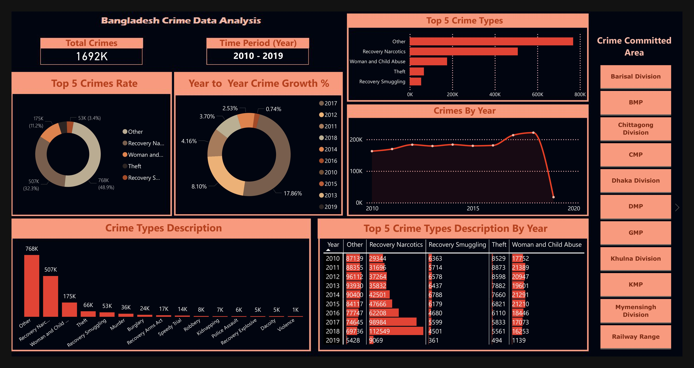

# Bangladesh Crime Data Analysis

## Table of Contents

- [Overview](#overview)
- [Data Source](#data-source)
    - [Dataset Description](#data-description)
- [Key Features](#key-features)
    - [Filters & Slicers](#filters--slicers)
    - [Visual Components](#visual-components)
- [Installation](#installation)
- [File Structure](#file-structure)
- [Usage](#usage)
- [Insights](#insights)
- [Technology Used](#technology-used)
- [Future Enhancements](#future-enhancements)
- [Contributing](#contributing)
- [License](#license)
- [Contact](#contact)


## **Overview**

This dashboard provides an in-depth analysis of crime data from Bangladesh spanning the years 2010–2019. The dataset includes reports from 16 different zones, including divisions and metropolitan areas such as Dhaka Division, Chittagong Division, Khulna Division, and more. The dashboard offers interactive visualizations to explore crime trends, growth rates, and distributions across various dimensions.
Below is a preview of the dashboard: <br><br>



## **Data Source**

The dataset was sourced from Kaggle and contains several records of [Bangladesh Crime Data from 2010 - 2019](https://www.kaggle.com/datasets/talhabu/bangladesh-crime-data-from-2010-2019). It includes information about different types of crimes (e.g., Theft, Recovery of Narcotics, and Abuse of Women and Children) and their occurrences across 16 zones.

### **Dataset Description**

| Column Name                 | Description                                                               |
|-----------------------------|---------------------------------------------------------------------------|
| `Area`                      | Zone or division (e.g., Dhaka Division, Chittagong Metropolitan).         |
| `Year`                      | Year of the crime report.                                                 |
| `Crime Types`               | Various crime categories (e.g., Theft, Recovery Narcotics).               |
| `Total Cases`               | Total number of incidents for each crime type in each year.               |

- **Time Period**: 2010–2019.
- **Area**:

    - `Dhaka Division`
    - `Dhaka Metropolitan`
    - `Khulna Division`
    - `Khulna Metropolitan`
    - `Rajshahi Division`
    - `Rajshahi Metropolitan`
    - `Chittagong Division`
    - `Chittagong Metropolitan, Barishal Division`
    - `Barishal Metropolitan`
    - `Sylhet Division`
    - `Sylhet Metropolitan`
    - `Rangpur Division`
    - `Mymensingh Division`
    - `Gazipur Metropolitan`
    - `Railway Range`


## Key Features

### Filters & Slicers

- **Slicer for Area**: Allows users to filter the dashboard by selecting specific zones or divisions.

### Visual Components

1. **Total Crimes Card**:
   - Displays the total number of crimes reported across all zones.
   
2. **Top 5 Crime Types Donut Chart**:
   - Shows the distribution of the top 5 crime types based on overall counts.
   
3. **Year-to-Year Crime Growth (%) Doughnut Chart**:
   - Visualizes the percentage change in total crimes year-over-year.
   
4. **Crimes by Year Line Chart**:
   - Tracks the trend of total crimes over time, with dynamic filtering by area.
   
5. **Top 5 Crime Types Bar Chart**:
   - Highlights the most common crime types for the selected area.
   
6. **Crime Types Description Table**:
   - Provides detailed counts for various crime types across years.


## Installation

1. **Clone the repository:**

    ```bash
    git clone https://github.com/tshihab07/Bangladesh-Crime-Data-Analysis.git
    ```
2. **Navigate to the project directory:**

    ```bash
    cd Bangladesh-Crime-Data-Analysis
    ```
3. Load the Data: Load the data into your visualization tool and ensure the data fields align with the visualizations.
4. Run the Dashboard: If using Power BI, open the .pbix file to view and interact with the dashboard.


## File Structure

This repository contains the following files:
```bash
BANGLADESH-CRIME-DATA-ANALYSIS/
├── AnalyticalDashboard.Report/
│   ├── .pbi/
│   │   │   └── localSettings.json
│   ├── StaticResources/
│   │   │   └── RegisteredResources/
│   │   │   │   └── bg6575885122849929.jpg
│   ├── SharedResources/
│   │   │   └── CY24SU08.json
│   │   ├── .platform
│   │   ├── definition.pbir
│   │   ├── report.json
├── AnalyticalDashboard.SemanticModel/
│   │   ├── .pbi
│   │   ├── .platform
│   │   ├── definition.pbism
│   │   ├── diagramLayout.json
│   │   └── model.bim
├── files/
│   │   ├── AnalyticalDashboard.pbit
│   │   ├── bg.pptx
│   │   ├── CrimeDataBD_cleaned.csv
│   │   └── CrimeDataBD.csv
├── output
│   ├── bg.JPG
│   ├── dashboard.jpg
│   ├── dashboard.pdf
├── .gitignore
├── AnalyticalDashboard.pbix
├── AnalyticalDashboard.pbip
├── data_preprocessing.ipynb
└── README.md
```


## Usage

1. **Open the Dashboard**:
   - Open the `AnalyticalDashboard.pbix` file in Power BI Desktop.
   
2. **Explore the Dashboard**:
   - Use the **Area Slicer** on the right to filter by zone or division.
   - Hover over visuals for additional details.

3. **Interact with Visuals**:
   - Click on segments of the donut chart to drill down into specific crime types.
   - Use the line chart to analyze trends over time.


## Insights

- **Total Crimes**: The dashboard shows the overall crime count for the entire period (2010–2019).
- **Year-to-Year Growth**: Identifies periods of increase or decrease in crime rates.
- **Top Crime Types**: Highlights which crimes are most prevalent across zones.
- **Temporal Trends**: Reveals seasonal or yearly patterns in crime occurrences.


## Technology Used

- **Data Preprocessing**: Python (for cleaning and transformation).
- **Visualization Tool**: Power BI (for building the dashboard).
- **Languages**: DAX (for measures and calculations).


## Future Enhancements

- **Geospatial Visualization**: Add maps to show crime distribution geographically.
- **Predictive Analytics**: Incorporate forecasting models to predict future crime trends.
- **User Interaction**: Add more interactive elements like bookmarks or drill-through views.


## Contributing

Contributions are welcome! If you'd like to contribute:
1. Fork the repository.
2. Make changes and submit a pull request.
3. Ensure your contributions align with the project's goals.


## License

This project is licensed under the [MIT License](LICENSE).


## Contact

For questions or feedback:
E-mail: tushar.shihab13@gmail.com<br>
More Projects: 👉🏿 [Projects](https://github.com/tshihab07?tab=repositories)<br>
LinkedIn: [Tushar Shihab](https://www.linkedin.com/in/tshihab07/)
